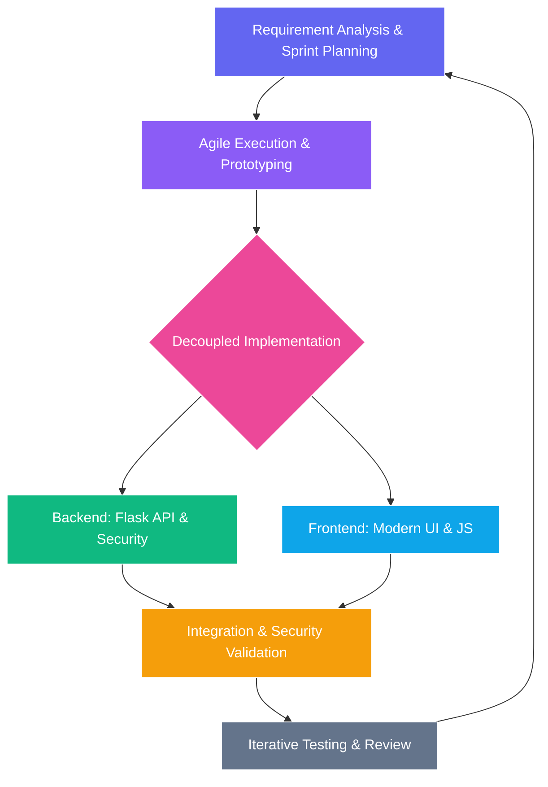

# Project Development Methodology

The **Online Crime Reporting System** was developed using a modern, structured approach that balances flexibility with security. The methodology can be summarized into four key pillars:

## Methodology Flowchart

## 1. Agile & Iterative Development
The project followed an **Agile-inspired methodology**. Instead of building the entire system at once, development was broken down into small, manageable "sprints." This allowed for continuous improvement and the ability to refine features (like the administrative dashboard or anonymous reporting) based on testing results after each iteration.

## 2. Decoupled Architecture (Client-Server Separation)
We adopted a **Modular Separation** between the Frontend and Backend:
- **Backend (API-Driven)**: Built as a robust data engine that handles security, file uploads, and logic.
- **Frontend (UI-Driven)**: Built as a lightweight interface that communicates with the backend via RESTful APIs.
This methodology ensures that the system is easier to maintain and can be scaled independently in the future.

## 3. Security-First Implementation
A core principle of our methodology was **"Security by Design."** Security was not added as a final step but integrated into the foundation:
- **Stateless Authentication**: Using JWT (JSON Web Tokens) to ensure secure sessions.
- **Data Protection**: Implementing industry-standard Bcrypt hashing for all sensitive user credentials from day one.

## 4. User-Centric Design Process (UI/UX)
The development was guided by a **Modern Aesthetic Methodology**. We prioritized high visual quality (Glassmorphism design) and responsiveness to ensure that the platform remains accessible and professional across desktops, tablets, and mobile devices.

---
**Methodology Overview Summary**
- **Process**: Agile & Iterative
- **Architecture**: Decoupled REST-based
- **Focus**: Security, Scalability, and Visual Excellence
